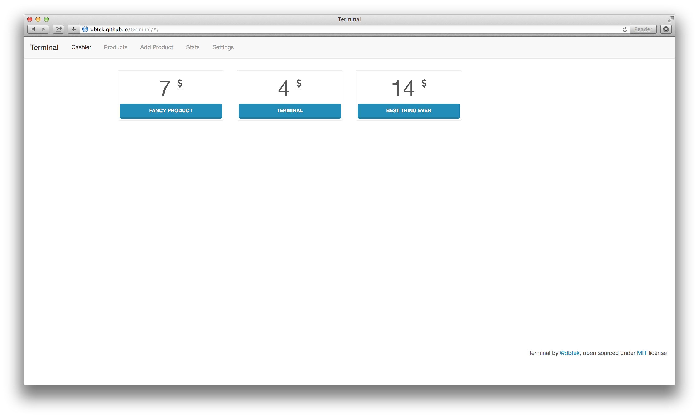

Terminal
-----------

Simple POS (point of sale) application. Can be used for all kind of retail stores.

##Usage
Simply go to [dbtek.github.io/terminal](http://dbtek.github.io/terminal) and start using it! You can download it and use locally too.

##Features
- Supports product adding, editing.
- Printing checks via POS printers for after payment product delivery.  
- Uses local Web Sql, it's totally your data.  
- Sale stats, see sale stats of products.

##Technical
It's an app build on [Angular JS](http://angularjs.org). Uses bunch of modules such as [angular-websql](https://github.com/dbtek/angular-websql), [angular-flot](https://github.com/develersrl/angular-flot), angular-route and angular-cookies.

Products and sale details are stored on browser's web sql database. Language and other settings are stored on local storage.

Frontend is built on Bootstrap and Lumen theme by Bootswatch.

##Locale
App built as multilingual. Currently has Turkish and English translations. There is also the currency support. Of course, there can be more locales and currencies. See [translations](http://github.com/dbtek/terminal/tree/master/app/local).

##Author
Ismail Demirbilek - [@dbtek](http://twitter.com/dbtek)

##License
[MIT](http://opensource.org/licenses/MIT)
